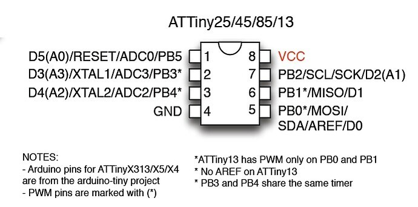

# ATTinySerial

**An Ultra-Minimalist, High-Performance UART TX Library for AVR ATtiny Microcontrollers (Arduino IDE compatible)**

The ATtiny microcontroller series (such as the ATtiny13, ATtiny25, ATtiny45, and ATtiny85) offers immense flexibility in a highly compact form factor. However, these devices suffer from severe Flash memory constraints (as low as 1KB) and a limited number of hardware timers. 

Standard communication libraries like `SoftwareSerial` are often too bloated for these controllers, consuming valuable timers and significant portions of Flash and RAM. **ATTinySerial** was developed to solve this problem by providing a highly optimized, TX-only (Transmit) bit-banging implementation that requires zero hardware timers and reduces function-call overhead to an absolute minimum.

---

## Core Features

* **Zero Hardware Timer Dependency:** 
  The library performs precise software-based timing using the highly predictable `_delay_loop_2` intrinsic function. This frees up the internal hardware timers (Timer0/Timer1) entirely for user applications like PWM generation, millis() tracking, or hardware interrupts.
* **Aggressive Flash Optimization via Inline Wrappers:** 
  To prevent the compiler from generating costly jump instructions and stack operations for formatting variants (e.g., appending newlines or casting integer types), `ATTinySerial` implements these wrappers as `inline` methods directly within the header file. This leads to near-zero abstraction overhead in the compiled binary.
* **Interrupt-Safe Bit-Banging:** 
  UART timing is highly sensitive to external interrupts. The library temporarily saves the Status Register (`SREG`), clears the global interrupt flag during the transmission of a single byte, and restores the state immediately after the stop bit.
* **Robust Numeric and Floating-Point Handling:** 
  Unlike many minimalist libraries that strip out floating-point math, `ATTinySerial` includes a robust implementation. It correctly handles `NaN` and `Infinity` states, provides 32-bit integer overflow protection, and natively implements rounding (e.g., rounding `0.999` correctly based on the specified decimal precision) without relying on bloated standard library implementations like `sprintf`.
* **Instruction Cycle Compensation:**
  The internal delay calculation automatically subtracts the required clock cycles needed for bit-shifting and loop operations (`cycles -= 3`), ensuring accurate baud rates even at low CPU frequencies.

---

## Architecture and Technical Design

### Hardware Port Optimization
Inside the core `write(char c)` function, pointer referencing is utilized to cache the `PORTB` register. Bitmasks for the specific TX pin and its inverse are pre-calculated before the critical timing section begins. This ensures that the state changes inside the bit-banging `for`-loop are executed in the minimum possible number of clock cycles (typically using `LD` and `ST` or `OUT` assembly instructions).

### Memory Management with PROGMEM
RAM is the most scarce resource on an ATtiny (the ATtiny13 possesses only 64 Bytes). To prevent string literals from being copied to SRAM during initialization, the library natively supports the `__FlashStringHelper` class. Wrapping strings in the `F()` macro forces the compiler to keep the data in Flash memory, reading it byte-by-byte via `pgm_read_byte()`.

---

## Installation

### Arduino IDE
1. Download this repository as a `.zip` file.
2. Open the Arduino IDE.
3. Navigate to **Sketch** > **Include Library** > **Add .ZIP Library...**
4. Select the downloaded `.zip` archive.

### PlatformIO
If you are using PlatformIO, you can clone the repository directly into your `lib/` directory or include it via `platformio.ini`:

---

## Code Examples

### 1. Basic Transmission
The simplest implementation initializing the transmission on the default pin (PB0).
```cpp
#include <ATTinySerial.h>

// Instantiate the object using default TX pin PB0
ATTinySerial serial;

void setup() {
    // Initialize UART at 9600 baud
    serial.begin(9600);
}

void loop() {
    serial.println("ATtiny is running.");
    delay(1000);
}
```

### 2. Memory Saving with PROGMEM (F-Macro)
On an ATtiny13 with only 64 Bytes of RAM, strings can crash your program. Use the F() macro to keep text in Flash memory!
```cpp
#include <ATTinySerial.h>

ATTinySerial serial(2); // Set TX pin to PB2

void setup() {
    serial.begin(9600);
    
    // The F() macro prevents the string from eating up your RAM!
    serial.println(F("This string lives in Flash Memory!"));
}

void loop() {
    // ...
}
```

### 3. Printing Sensors & Floats
ATTinySerial comes with a robust float-to-string implementation. It automatically handles rounding and negative numbers.
```cpp
#include <ATTinySerial.h>

ATTinySerial serial(0);

void setup() {
    serial.begin(9600);
}

void loop() {
    float temperature = 24.5678f;
    int32_t uptime = 100000;
    
    serial.print(F("Temp: "));
    serial.print(temperature, 2); // Print with 2 decimal places -> "24.57"
    serial.println(F(" C"));
    
    serial.print(F("Uptime: "));
    serial.println(uptime);       // Handles large 32-bit integers perfectly
    
    delay(2000);
}
```

### 4. Full Test
A small program to test all features and output results to the serial monitor, including an error notification on fail if a watchdog reset is triggered.
```cpp
#include <ATTinySerial.h>
#include <avr/wdt.h>

ATTinySerial debugSerial;

void setup() {
    uint8_t resetCause = MCUSR;
    MCUSR = 0;
    wdt_disable();

    debugSerial.begin(9600);

    if (resetCause & _BV(WDRF)) {
        debugSerial.println(F("ERROR: watchdog reset"));
    } else {
        debugSerial.println(F("OK: startup"));
    }

    wdt_enable(WDTO_8S);
}

void loop() {
    wdt_reset();
    debugSerial.println(F("ATTinySerial test"));
    debugSerial.write('>');
    debugSerial.println();

    debugSerial.print(F("char: "));
    debugSerial.println('A');
    debugSerial.print(F("string: "));
    debugSerial.println("RAM string");
    debugSerial.print(F("flash: "));
    debugSerial.println(F("Flash string"));

    debugSerial.print(F("bool: "));
    debugSerial.print(true);
    debugSerial.print(' ');
    debugSerial.println(false);

    debugSerial.println((int8_t)-128);
    debugSerial.println((uint8_t)255);
    debugSerial.println((int16_t)-32768);
    debugSerial.println((uint16_t)65535);
    debugSerial.println((int32_t)(-2147483647L - 1L));
    debugSerial.println((uint32_t)4294967295UL);

    debugSerial.print(F("float: "));
    debugSerial.println(23.4567f, 4);
    debugSerial.println(-0.0049f, 3);
    debugSerial.println(12.5f, 0);
    debugSerial.println(1.0f / 3.0f, 9);
    debugSerial.println(NAN, 2);
    debugSerial.println(INFINITY, 2);
    debugSerial.println(-INFINITY, 2);
    debugSerial.println(4294967296.0f, 2);

    wdt_reset();
    debugSerial.println(F("OK: test complete"));
    debugSerial.println();

    delay(5000);
}
```

---

## API Reference

### Initialization & Setup

* **`ATTinySerial(uint8_t pin = 0)`**  
  Instantiates the class object. It assigns the target transmission pin on `PORTB`, defaulting to `0` (which corresponds to `PB0`).

* **`void begin(uint32_t baudrate)`**  
  Configures the designated TX pin as an output, pulls it high to establish the proper UART idle state, and calculates precise delay cycles based on the core CPU frequency (`F_CPU`) and the target `baudrate`.

* **`void begin(uint32_t baudrate, uint8_t pin)`**  
  Allows you to reassign the active TX pin dynamically and initialize the transmission parameters in a single combined step.

### Core Transmission

* **`void write(char c)`**  
  The low-level transmission engine. It handles the start bit, shifts out 8 data bits (least-significant-bit first), and concludes with the stop bit. To guarantee uncorrupted bit-banging timing, global interrupts are temporarily suspended using `cli()` for the duration of the byte transmission.

### Data Output (`print`)

* **`void print(char c)`**  
  Transmits a single character directly, acting as a direct wrapper around `write()`.

* **`void print(const char* str)`**  
  Iterates through and transmits a null-terminated character string stored in SRAM. It includes built-in `nullptr` protection to prevent runtime crashes.

* **`void print(const __FlashStringHelper* str)`**  
  Transmits string literals stored directly in Flash memory via PROGMEM (`pgm_read_byte`), preserving scarce SRAM. This method is utilized automatically alongside the `F()` macro.

* **`void print(bool b)`**  
  Evaluates a boolean condition, outputting ASCII `'1'` for true and `'0'` for false.

* **`void print(int8_t` / `int16_t` / `int32_t num)`**  
  Converts signed integers of various widths into human-readable decimal strings. It cleanly handles edge cases and negative boundaries.

* **`void print(uint8_t` / `uint16_t` / `uint32_t num)`**  
  Converts unsigned integers into their decimal string representations.

* **`void print(float num, uint8_t decimals = 2)`**  
  Formats and transmits floating-point values with a user-defined precision (capped at a maximum of 9 decimal places). It features built-in handling for `NaN`, `Inf`, and `-Inf`, precise rounding adjustments (`+0.5f`), and 32-bit scale overflow protection (`ovf`).

### Formatting & Line Termination (`println`)

* **`void println()`**  
  Transmits a standard serial line ending sequence consisting of a Carriage Return (`\r`) followed by a Line Feed (`\n`).

---

## Pinout Schematic



---

## Printing Data

The `print()` and `println()` functions support almost all native types:

- Characters: `print(char c)`
- Strings: `print(const char* str)` & `print(const __FlashStringHelper* str)`
- Booleans: `print(bool b)` (Outputs `'1'` or `'0'`)
- Integers: `int8_t`, `uint8_t`, `int16_t`, `uint16_t`, `int32_t`, `uint32_t`
- Floats: `print(float num, uint8_t decimals = 2)`
(Note: `println` variants simply append `\r\n` to the output.)

---

## Limitations

To maintain its ultra-compact footprint, this library operates under specific constraints:

1. **Half-Duplex / TX-Only**: This library cannot receive (RX) serial data. It is intended strictly for data transmission, logging, and debugging.
2. **Blocking Execution**: During the transmission of a byte, _delay_loop_2 occupies the CPU completely, and global interrupts are temporarily turned off. High-frequency time-sensitive tasks running in the background may experience slight jitter.
3. **Clock Speed Dependency**: The baud rate accuracy depends directly on an accurate F_CPU definition. Lower frequencies (like 1 MHz) limit reliable maximum baud rates compared to an 8 MHz configuration.

